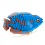
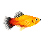

# fishtank sim

## Requirements
Install DebugGUI asset to fishtank/Assets/Plugins

## Resources
- http://www.theaquariumwiki.com/wiki/Main_Page

## General Plans
- Should fish have happiness?
- Come up with a SOLID system for units of measurement.
- Should fish be able to reproduce?
- System for plants growing dynamically? (simple random patterns?)

## Animation plans
One script for each type of movement that can be easily reused with a few ambiguous variables like speed.
- Boids https://www.youtube.com/watch?v=bqtqltqcQhw
- Schooling fish (swim with others of same size class)
- Territorial Fish (avoid others of same size class or larger)
- Benthic fish (sticks to the bottom mostly)
- Snail (slow edge bound movement)
- Water Bug (irratic movement)

## Design Plans
- Each Fish is an entity
- Each plant is an entity
- Simulation consists of updating a series of environment parameters each step based on all the other entities
- Control light
- Control tank flow (filter bandwidth)
- Control filter medium (Carbon filter)
- Control temperature

## Data
- fish.json : JSON format fish data including all variables and scientific information. Structure has to be air-tight before we start adding tons of these, because it will be hard to change once there are a lot.
- plants.json : similar to the fish one, but plants.
- substrate.json : Types of substrate for the tank and its effects on the water quality
